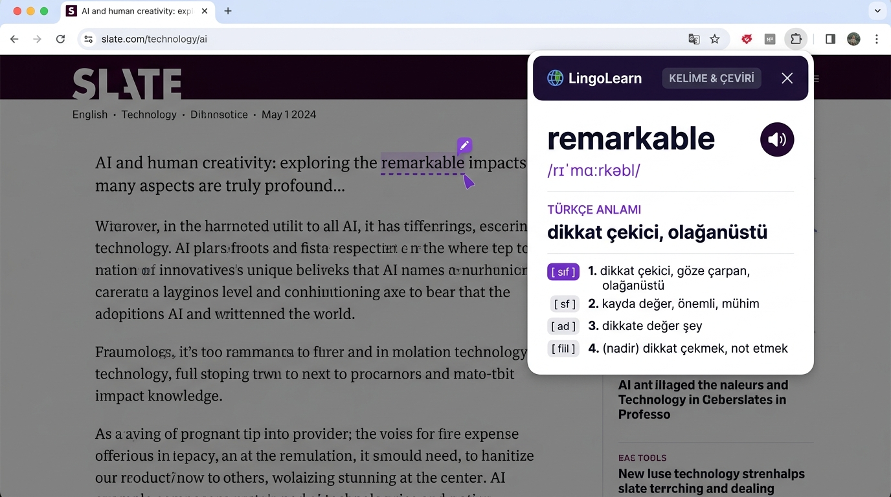
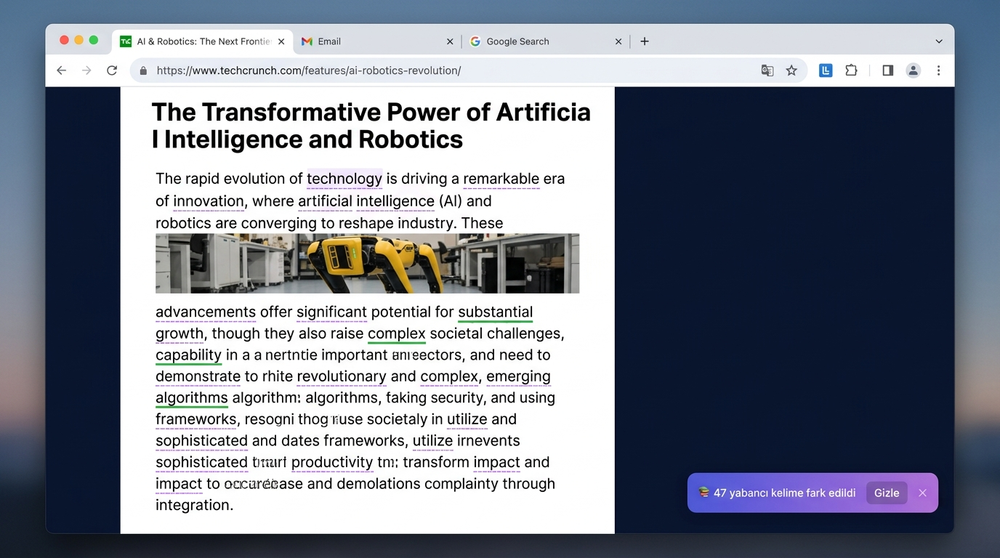
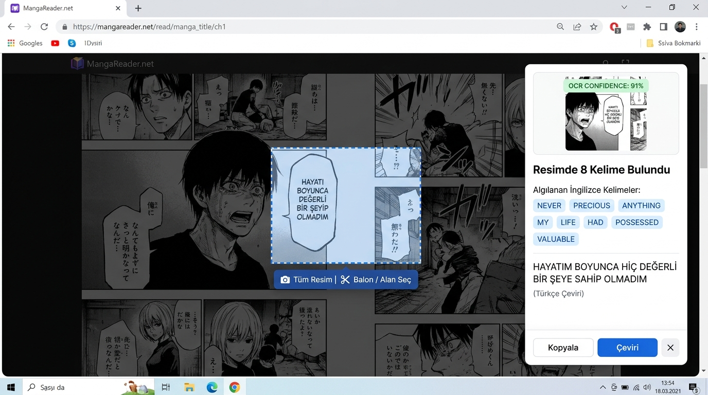
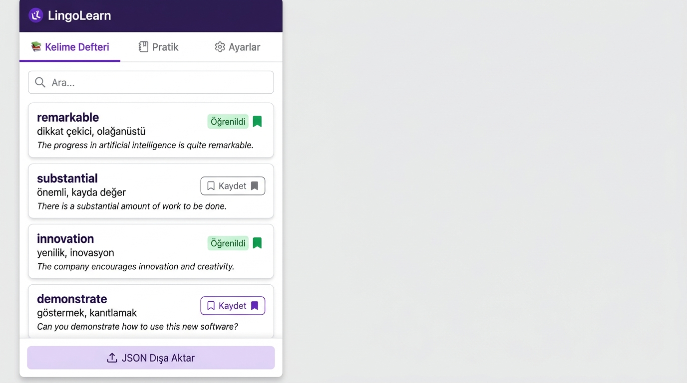
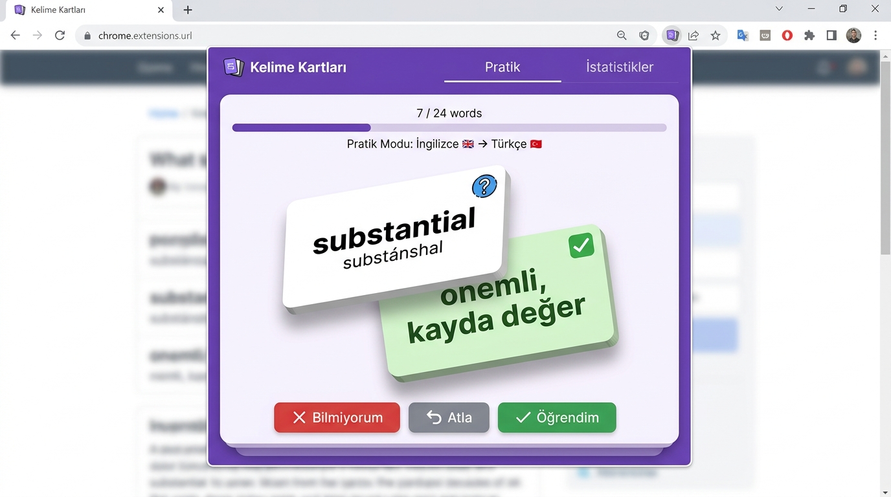

<div align="center">

# 🌟 LingoLearn

### İngilizce Öğrenme & Çeviri Tarayıcı Eklentisi

Web sitelerinde gezerken **İngilizce kelimeleri anında öğrenin** — kelime seçin, çeviriyi görün, telaffuzu dinleyin, defterinize kaydedin.

[](https://developer.chrome.com/docs/extensions/mv3/)
[](https://chrome.google.com/webstore)
[](https://microsoftedge.microsoft.com/addons/)
[](LICENSE)

</div>

---

## 📸 Ekran Görüntüleri

### 1️⃣ Kelime & Çeviri Kartı
> Herhangi bir İngilizce kelimeye **tek tıklayın** — fonetik okunuş, Türkçe anlam ve sözlük detayı anında açılır. Kartı tutup **istediğiniz yere sürükleyebilirsiniz.**



---

### 2️⃣ Otomatik Kelime Tarama
> Sayfa açıldığında eklenti İngilizce kelimeleri **otomatik fark eder** ve altını mor kesikli çizgiyle işaretler. Daha önce kaydettiğiniz kelimeler **yeşil** görünür.



---

### 3️⃣ Resim & Manga OCR — Konuşma Balonu Seçimi
> Resmin üzerine gelin → **✂️ Balon / Alan Seç** butonuna tıklayın → fareyle konuşma balonunu çizin → eklenti metni okuyup Türkçe'ye çevirir.



---

### 4️⃣ Kişisel Kelime Defteri
> Öğrenmek istediğiniz kelimeleri **bağlamıyla birlikte** kaydedin. Öğrenildi olarak işaretleyin. JSON ile dışa aktarın.



---

### 5️⃣ Flashcard Pratik Modu
> Kaydettiğiniz kelimeleri **3D kart çevirme** yöntemiyle test edin. Biliyorum / Bilmiyorum ile ilerleme kaydedin.



---

## ✨ Tüm Özellikler

| Özellik | Açıklama |
|---------|----------|
| 🔍 **Otomatik Tarama** | Sayfadaki İngilizce kelimeleri algılar, altını çizer |
| 💬 **Anlık Çeviri** | Çift tıklama, Alt+tıklama veya metin seçimi ile çeviri kartı |
| 🔊 **Sesli Telaffuz** | Web Speech API ile doğal İngilizce ses |
| 📖 **IPA Fonetik** | Okunuşu `/rɪˈmɑːrkəbl/` gibi gösterir |
| 📷 **Görsel OCR** | Resimlerdeki yazıları Tesseract.js ile okur |
| ✂️ **Balon Seçimi** | Manga konuşma balonunu farenizle seçip okutun |
| 📚 **Kelime Defteri** | Kelimeleri bağlamıyla kaydedin |
| 🎴 **Flashcard** | 3D kart çevirme ile pratik modu |
| 📤 **JSON Dışa Aktar** | Anki / Quizlet'e aktarılabilir format |
| 🧲 **Sürüklenebilir Kart** | Çeviri kartını istediğiniz yere taşıyın |
| 🛡️ **Shadow DOM** | Sitelerin CSS'i eklenti tasarımını bozmaz |

---

## 🛠️ Kurulum

1. Bu repoyu indirin:
   ```bash
   git clone https://github.com/YusufBaranYildiz/lingolearn-extension.git
   ```

2. `lib/` klasörüne Tesseract model dosyasını indirin:
   ```
   https://github.com/naptha/tessdata_fast/raw/main/eng.traineddata.gz
   → lib/ klasörüne koyun
   ```

3. Tarayıcıda `chrome://extensions` veya `edge://extensions` açın

4. **Geliştirici Modunu** etkinleştirin

5. **"Paketlenmemiş öğe yükle"** → `lingolearn-extension` klasörünü seçin

---

## 📁 Proje Yapısı

```
lingolearn-extension/
├── manifest.json           # Manifest V3 yapılandırması
├── background.js           # Servis Worker — Çeviri API & Offscreen yönetimi
├── offscreen.html          # Güvenli OCR çalışma belgesi
├── offscreen.js            # Tesseract.js v5 WebAssembly OCR motoru
├── content/
│   ├── content.js          # Kelime algılama, çeviri kartı, OCR, sürükleme
│   └── content.css         # Sayfa üzeri stiller ve modal tasarımı
├── popup/
│   ├── popup.html          # Kelime defteri & ayarlar arayüzü
│   ├── popup.css           # Popup stilleri
│   └── popup.js            # Defter yönetimi, flashcard testi
├── lib/                    # Yerel Tesseract OCR kütüphanesi
├── icons/                  # Eklenti ikonları (16, 48, 128px)
└── screenshots/            # README görselleri
```

---

## 🧰 Teknik Mimari

| Bileşen | Teknoloji |
|---------|-----------|
| Manifest | V3 |
| OCR | Tesseract.js v5 (WASM LSTM) |
| OCR İzolasyonu | Chrome Offscreen Document API |
| Çeviri | Google Translate API |
| UI İzolasyonu | Shadow DOM |
| Depolama | `chrome.storage.local` |

---

## 🗺️ Yol Haritası

- [ ] Firefox desteği
- [ ] Çevrimiçi kelime senkronizasyonu
- [ ] Japonca / Korece OCR
- [ ] Spaced Repetition (SM-2) algoritması
- [ ] Sesli telaffuz değerlendirme

---

## 👤 Geliştirici

**Yusuf Baran Yıldız** — [@YusufBaranYildiz](https://github.com/YusufBaranYildiz)

---

<div align="center">
MIT Lisansı ile lisanslanmıştır — özgürce kullanabilir, geliştirebilir ve paylaşabilirsiniz.
</div>
